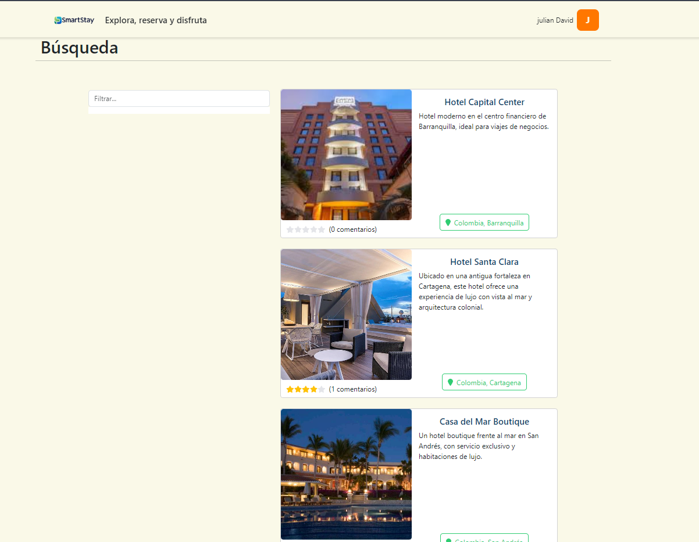
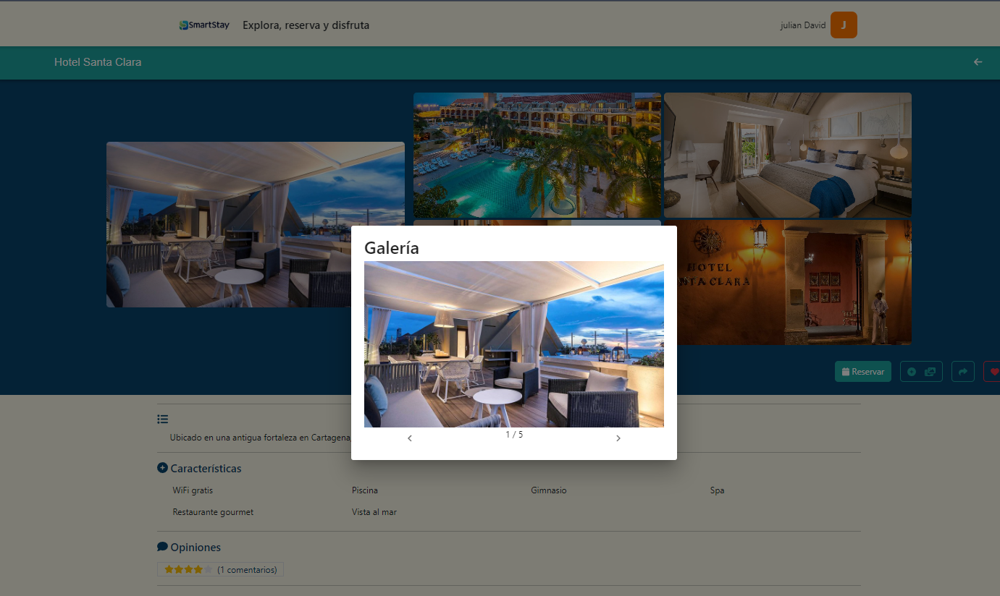
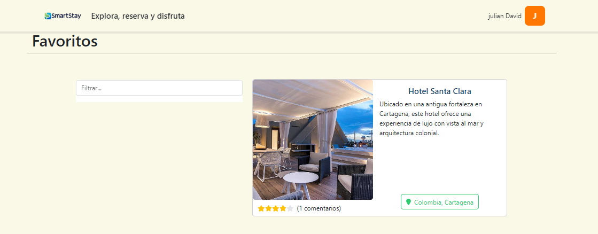
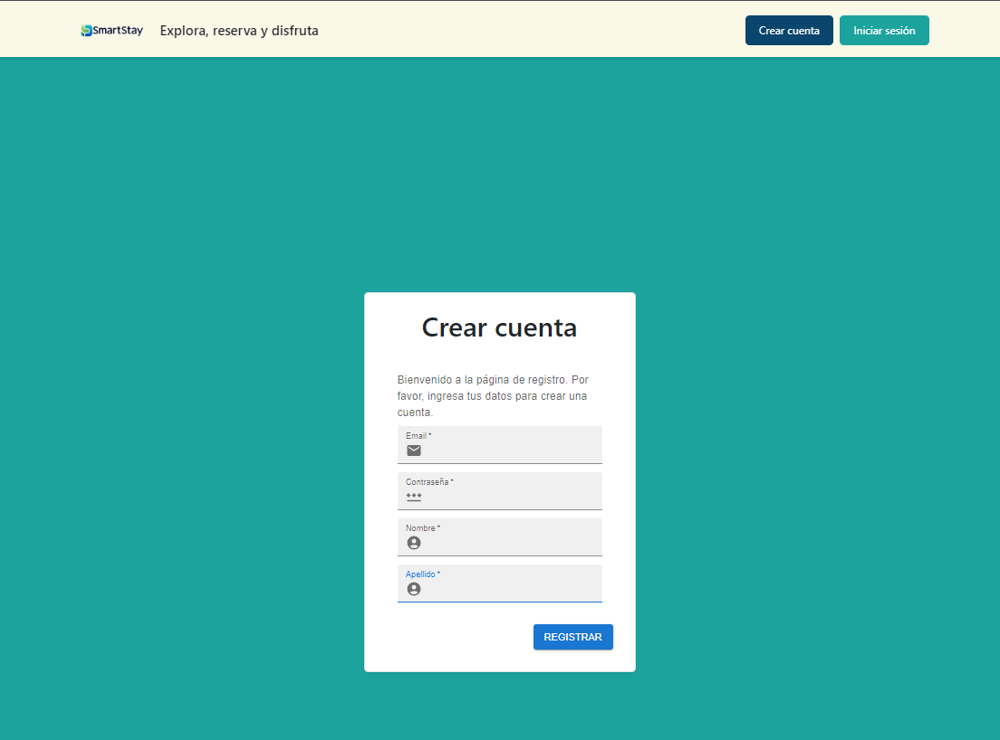
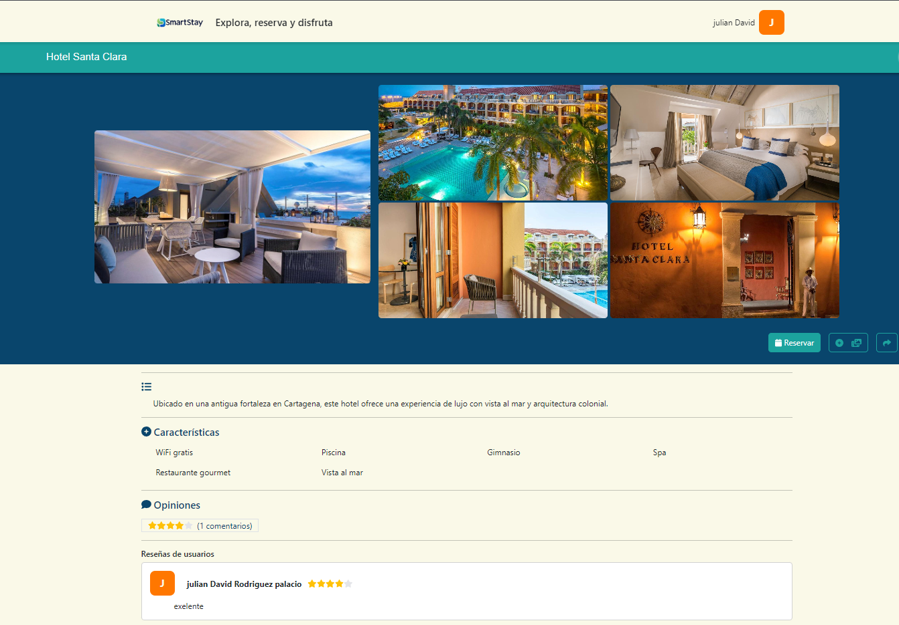

# 🏨 SmartStay

Este proyecto corresponde al desafío final del curso "Professional Developer" de Digital House, con el respaldo de Globant y Mercado Libre.
Se trata de una aplicación web desarrollada con Java y Spring Boot para el backend, ReactJS para el frontend, y MongoDB como base de datos.

La propuesta es construir una plataforma de reservas online, donde los usuarios puedan reservar habitaciones fácilmente. A esta aplicación decidí llamarla SmartStay.

El proyecto es open source, por lo que cualquiera puede hacer un fork, personalizarlo a su manera o incluso tomarlo como punto de partida para desarrollar una aplicación propia.

Al haber clonado y realizado todos los pasos, el proyecto se corre ejecutando el jar del application, y el frontend en modo dev con `npm start` estando dentro
de la carpeta de `client`

- ⚙️ Backend: Java + Spring Boot
- 🖥️ Frontend: ReactJS
- 🗃️ Base de datos: MongoDB
- ☁️ Herramientas: Node.js, Maven, Postman

**🛠️ Features:**

- Registro y autenticación de usuarios.
    - Los usuarios guardados tienen la contraseña hasheada a una lista de bytes para más seguridad, la aplicación nunca sabrá la contraseña de sus usuarios.
    - JWT para mantener sesión iniciada. Esta no contiene datos sensibles. Se usa en cada request también para verificar que realmente se esté logueado y si tiene permisos especiales.
    - La JWT de sesión expira para evitar que alguien intentara obtener el secret key con fuerza bruta (imposible igualmente sin una computadora cuántica)
    - El registro envía una confirmación al email. Esta confirmación es un link con un JWT que confirmará tu usuario y ya podrás loguear.
    - El JWT del registro utiliza otro secretKey, ya que al no expirar "podría usarse" fuerza bruta. Aunque es simplemente para más seguridad.
    - Si intentas registrarte con una cuenta que tiene un email sin confirmar, re-enviará el email y notificará al usuario.
    - Asignación de permiso administrativo, éste es reactivo. Esto quiere decir que si nos asignar administrador estando en la página, se cambiará nuestro JWT y actualizará el menú por el uso de websockets.
    - Modificación de datos (nombre, apellido, contraseña)
    - Email de notificación al cambiar contraseña.
    - Añadir productos a favoritos.
- Registro y modificación de productos/categorías.
    - Los administradores podrán crear, modificar y eliminar productos (título, descripción, imágenes, categoría, características, políticas de uso)
    - También podrán crear, modificar y eliminar categorías (título, descripción, imagen)
    - Todas las modificaciones/creaciones/eliminaciones (productos y categorías) son reactivos a los usuarios, gracias a los websockets.
    - Compartir productos por redes sociales, también se adjunta imagen, título y descripción en Twitter/Facebook por medio de las cards.
- Página reactiva a diferentes resoluciones/mobile.
- Búsqueda principal por fecha y lugar.
    - Autocomplet con las ciudades y países disponibles.
    - Calendario para seleccionar fechas.
- Reserva de productos
    - Calendario doble donde se puede seleccionar las fechas para reservar.
    - Luego de la reserva, se puede realizar una review.
    - La página principal del producto tiene también las opiniones de los usuarios y sus comentarios.
    - Valoración general en base a todas las reseñas, además es reactiva a las reseñas que se vayan creando en tiempo real.
    - Se puede añadir un producto a tu wishlist y acceder a ella desde el menú de usuario.
    - Botón de Whatsapp para comunicarse directamente con el dueño del producto.
    - Email de información luego de realizar la reserva satisfactoriamente.
    - Historial de reservas donde se ordenan por fecha de ingreso (Check-in)

    ## 🎯 Funcionalidades principales

- 🔍 Búsqueda de hoteles por ubicación y fecha
- 🏆 Filtros por estrellas, precio, popularidad
- ❤️ Agregar y ver hoteles favoritos
- 🖼️ Vista detallada de cada hotel
- 👤 Registro e inicio de sesión de usuarios
- 📦 Gestión de reservas

### 🔍 Búsqueda
![Búsqueda]

### 🎠 Carrusel
![Carrusel]

### ⭐ Favoritos
![Favoritos]

### 🔐 Login
![Login]

### 🛍️ Producto
![Producto]

### 📦 Recomendados
 - <a href="https://nodejs.org/en/download">Download</a>
- MongoDB (I recommend to install Mongo Compass also) - <a href="https://www.mongodb.com/docs/manual/installation/">Download</a>
- Java 17 - <a href="https://www.oracle.com/java/technologies/javase/jdk17-archive-downloads.html">Download</a>

## 🛠️ Instalación y ejecución

# Clona el repositorio
git clone https://github.com/tu-usuario/tu-repo.git

# Entra al proyecto
cd tu-repo

# Instala dependencias frontend
cd frontend
npm install
npm start

# Ejecuta backend
cd ../backend
./mvnw spring-boot:run

# ⚠️ Environment-Variables

Para que el proyecto funcione, deberás setear todas las variables de entorno en el archivo `.env` que debe estar en el mismo directorio que encontrarás el `.env.example`

`.env`
```.env
MONGO_DATABASE=""
MONGO_USER=""
MONGO_PASSWORD=""
MONGO_CLUSTER=""
JWT_SECRET_KEY=""
JWT_SECONDARY_SECRET_KEY=""
MAIL_USERNAME=""
MAIL_PASSWORD=""
MAIL_HOST=""
MAIL_PORT=
URL=""
```